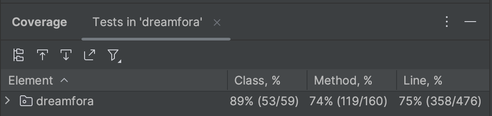
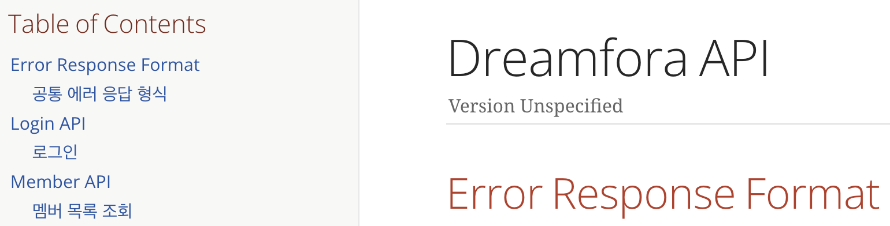

# 백오피스 시스템 개발 및 운영 효율성 향상
- 문제: 기존의 백오피스 시스템은 레거시로 인해 유지보수가 어려워 개발 및 운영팀이 필요한 기능을 추가하지 못하는 상황이었음.
- 해결책: 기존의 낡은 시스템을 대체할 신규 백오피스 시스템 MVP를 개발하고 배포하여 운영 효율성에 기여함.

✅ NextJS, JAVA, Spring Boot, JPA, MariaDB 기술을 활용, 풀스택 개발  
✅ ATDD, TDD 기반 개발로 테스트 커버리지 75% 달성  

✅ Rest Docs를 활용한 문서 자동화  

✅ 클라이언트 개발자들이 신규 업데이트 기능인 인앱 재화 관련 기능을 쉽게 테스트 할 수 있도록 포인트 관리 기능 개발 → 불필요한 소통 시간 단축  
✅ 기존에 엑셀로 전달받아 DB에서 직접 쿼리로 작성하던 비효율적인 프로모션 코드 등록 업무를 간편화 → 업무 처리 시간 단축   

