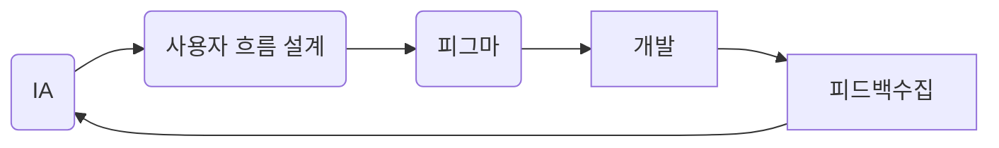
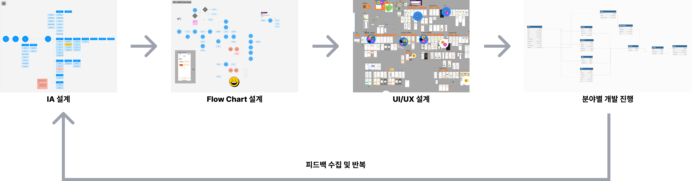
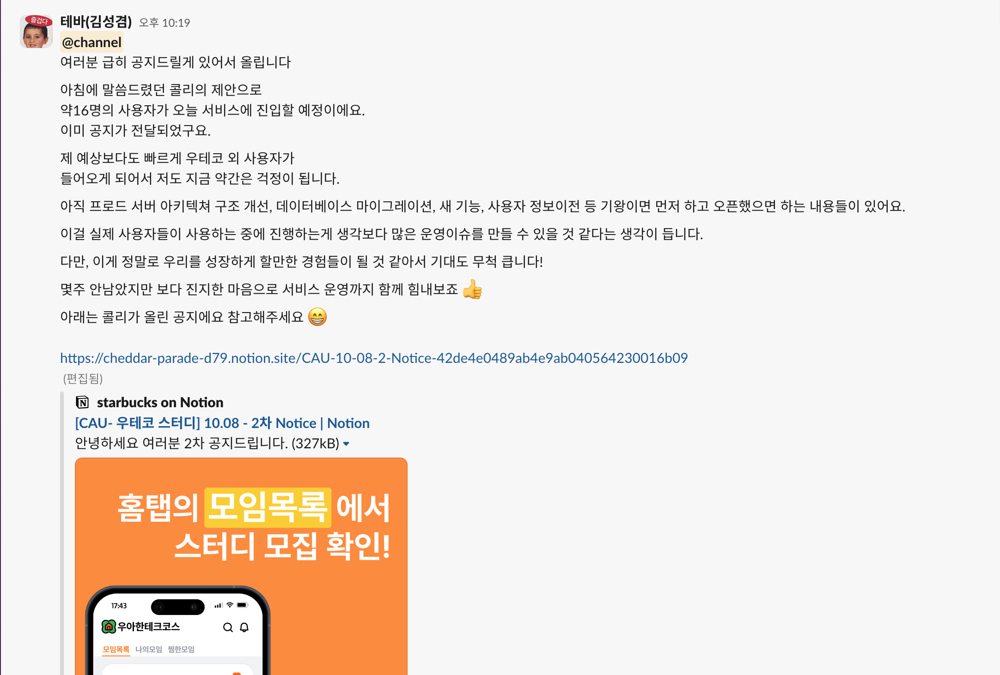

# **🚀 모우다 협업 개선 노력**

📌 **단순히 기능을 개발하는 것이 아니라, 협업의 방식 자체를 개선하려 노력했습니다.**  
📌 **기획 → 디자인 → 개발 → 피드백의 반복적인 개선 흐름을 도입하고, 팀원들이 원활하게 작업할 수 있도록 환경을 정리했습니다.**

---

## **1️⃣ UI/UX 기반 기획 & 협업 프로세스 개선**  
### **📌 IA(Information Architecture) → Flow Chart → UI/UX 디자인 → 개발 → 피드백 반복 과정 도입**  
> **대학에서 배운 UI/UX 수업을 바탕으로, "체계적인 기획과 디자인을 거쳐 개발을 진행해야 한다"는 점을 강조**  
> **기획과 개발을 분리하지 않고, 피드백을 반영하면서 지속적으로 개선하는 방식을 도입**  

✅ **협업 흐름**  
📌 **기획 → IA → Flow Chart → UI/UX 디자인 → 개발 → 피드백 반복**  

✅ **정보 구조를 먼저 정리하고, UI 설계를 명확하게 한 후 개발 진행**  
✅ **개발 후에도 피드백을 받고, 다시 기획으로 돌아가 개선하는 방식 적용**  

---

## **2️⃣ 팀 내 발표 및 공유 문화 기여**  
📌 **"팀이 같은 방향을 바라볼 수 있도록, 지속적인 공유와 발표가 필요하다"는 점을 인식**  

✅ **직접 발표하고 문서화했던 내용들**  
- [**모우다 이슈 해결기 - CORS(1)**](https://mouda-blog.github.io/posts/cors-1/)  
- [**모우다 이슈 해결기 - CORS(2)**](https://mouda-blog.github.io/posts/cors-2/)  

## **3️⃣ 리팩토링 가이드 문서 작성**  
📌 **"무작정 리팩토링을 하면, 개발 생산성이 떨어질 수 있다"는 점을 고려하여 가이드 문서를 작성**  

✅ **팀 내 공유 자료 목록**  
- [**백엔드 리팩토링 가이드**](https://successful-jeep-771.notion.site/5dcd0d9636bf4e67a6dbed406d1237ce?pvs=74)  
- [**QA 목록 문서**](https://successful-jeep-771.notion.site/QA-97be59e34f0b4c90879fb9e8a1ced717)

## **4️⃣ 사용자 확보를 위해 노력한 과정**  
📌 **"좋은 서비스를 만들어도, 사용자가 없다면 의미가 없다"는 점을 고려하여 직접 사용자 모집을 진행**  

✅ **서비스 초기 사용자를 확보하기 위한 방법들**  
- 직접 대학 커뮤니티를 활용하여 **16명의 지속적인 사용자 모집**  
- 사용자 피드백을 수집하고, 이를 바탕으로 기능 개선 방향을 정리  
- 사용자의 **이탈 원인을 분석하여, 서비스 개선 방향 수립 및 신기능 기획**  

