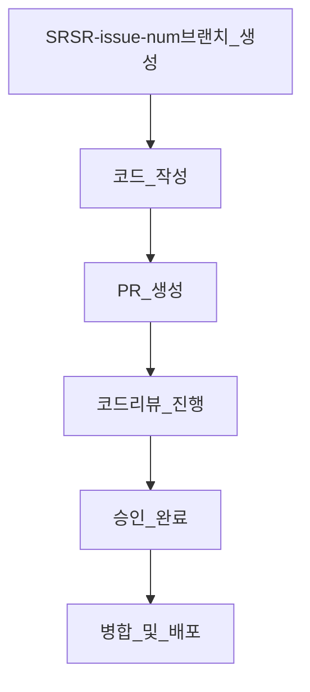
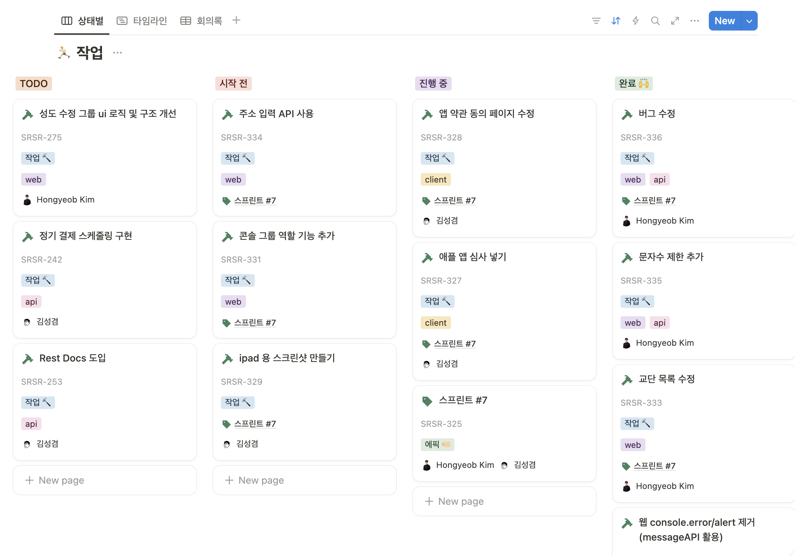
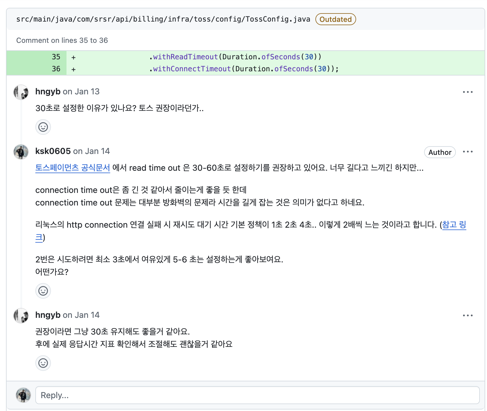
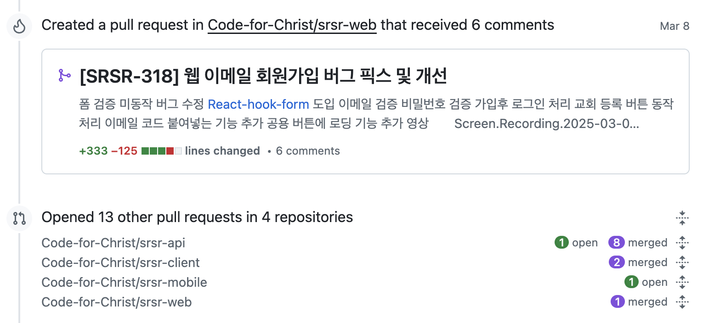
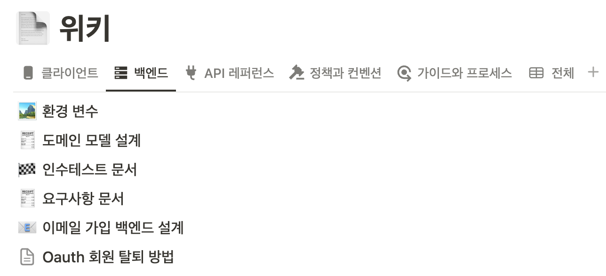

# 스르스르 업무 방식

### 🛠 협업 방식 (Git Flow & PR 리뷰)

✅ Git Flow를 활용한 협업 방식  
✅ PR을 통해 코드 리뷰를 거쳐, 지속적인 개선 진행

### 둘이서 개발한다고 대충하지 않습니다

#### 모든 업무는 스프린트 및 이슈 단위로 진행
* 1주일 단위로 스프린트를 진행
* 모든 업무는 트래킹이 될 수 있도록 이슈를 먼저 발행

#### 성실한 리뷰 
* 리뷰는 경어로, 정중하고 신중하게
* 신뢰할 만한 근거로 답변하기

### 분야와 책임을 가르지 않기
* **2명의 소수 인원이 기획-개발-배포-운영 모든 단계를 수행**해야하기 때문에 **분야(프론트/백)가 아닌 특정 기능 단위(ex. 관리자 검증 기능 추가) 로 업무** 수행 
* 모든 업무는 풀스택으로 진행
  
* 문제가 생길 시 언제든, 누구라도 대응할 수 있도록 문서화
  

### 근거 있는 개발하기
* 필요하다면 실제 실험을 통해 근거를 마련
  * [EAV 도입을 위한 mysql vs postgesql 실험 python 소스코드](https://github.com/ksk0605/portfolio/blob/main/srsr_mohim_project/code)